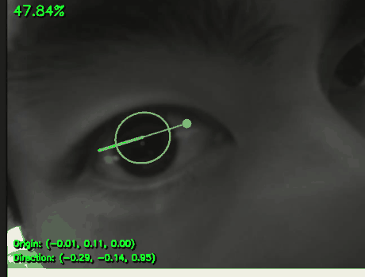

# 창종설 — Gaze-in-World SLAM (착용형 시선 3D 매핑)

착용형 IR 아이트래킹으로 **시선 벡터**를 얻고, 스테레오-이너셜 SLAM으로 **머리(카메라)의 6DoF pose**를 얻어,
"사용자가 지금 세계 좌표계의 어느 3D 지점을 보고 있는가"를 실시간으로 복원·시각화하는 프로젝트.

> 2026 창의적 종합설계 경진대회 · **팀 MoLBWA** · 남준현

## 데모 — 실시간 3D 시선 벡터 추출
동공에 타원 락온 → 안구 구 모델 → **3D 시선 벡터**(`Direction`)까지 실시간 추출.



> 위 GIF는 IR 카메라 도착 전 **RealSense D455**로 파이프라인을 관통 검증했을 때의 기록이다.
> 현재는 **GC0308 IR 카메라**로 교체되어 `src/uvc_gaze_test.py`가 진입점.
> 알고리즘: [JEOresearch/EyeTracker](https://github.com/JEOresearch/EyeTracker) (Orlosky 검출기) + numpy2 overflow 수정.

## 한 줄 요약
```
IR 눈 카메라 → 동공/시선 벡터 (Orlosky 3D 트래커)
스테레오 카메라 → 깊이 (StereoSGBM) + pose (ORB-SLAM3 VI)
        └── 융합 → 시선이 향하는 세계 3D점 p_W + 시선 광선 → Rerun 시각화
```

## 하드웨어
| 부품 | 모델 | 역할 |
|------|------|------|
| 눈 카메라 | **GC0308** (UVC, 640×480@30fps) | IR 동공 촬영 |
| IR 조명 | 850nm LED | 조명 안정화 |
| 씬 카메라 | oCamS-1MGN-U (스테레오 + 내장 IMU) | 스테레오 깊이 + VI-SLAM |
| 엣지 | Raspberry Pi 5 | 캡처 + 동공검출 + 스트리밍 (전송 위주) |
| 데스크톱 | (본체) | SLAM + 융합 + 시각화 |

> ⚠️ 눈 카메라는 당초 계획한 **OV9281(모노 글로벌셔터)에서 GC0308로 변경**되었다.
> **롤링셔터 · 30fps · 컬러센서**라 사케이드(saccade)는 원리상 잡히지 않는다.
> → 목표를 **fixation(응시) 기반 3D 히트맵**으로 확정. 근거와 영향은 [docs/09_visualization.md](docs/09_visualization.md).

## 문서 지도
- [docs/00_overview.md](docs/00_overview.md) — 전체 아키텍처 / 변환 사슬
- [docs/01_eye_tracking.md](docs/01_eye_tracking.md) — 동공 검출 + 캘리브레이션
- [docs/02_stereo_slam.md](docs/02_stereo_slam.md) — 스테레오 깊이 + ORB-SLAM3
- [docs/03_fusion.md](docs/03_fusion.md) — 융합 수식 (프로젝트의 심장)
- [docs/04_sync.md](docs/04_sync.md) — 타임스탬프 동기화
- [docs/05_pi_streaming.md](docs/05_pi_streaming.md) — Pi 스트리밍 / 대역폭
- [docs/06_roadmap.md](docs/06_roadmap.md) — 0~3단계 실행 계획
- [docs/07_accuracy.md](docs/07_accuracy.md) — 정확도 기대치 / 설계 지침
- [docs/08_materials_BOM.md](docs/08_materials_BOM.md) — 물품 구매 목록(BOM)
- [docs/09_visualization.md](docs/09_visualization.md) — **시각화 설계 (Rerun) + GC0308이 설계에 미치는 영향**
- [docs/10_realsense_tsdf_mapping.md](docs/10_realsense_tsdf_mapping.md) — RealSense TSDF 매핑 실험
- [docs/11_camera_imu_calibration.md](docs/11_camera_imu_calibration.md) — **oCamS camera–IMU Kalibr 절차·실측 결과·ORB-SLAM3 적용**

## 셋업
아이트래킹 알고리즘은 서드파티 레포를 쓰므로 별도 클론 + 패치가 필요하다 (리포엔 미포함).
```bash
# 1) 아이트래커 클론
git clone https://github.com/JEOresearch/EyeTracker.git external/EyeTracker

# 2) numpy2 uint8 overflow 수정 (필수) — patches/PATCH_NOTES.md 의 int() 캐스팅 4곳
#    (안 하면 동공 대신 눈꺼풀 전체를 잡는 오검출 발생)

# 3) 의존 패키지
pip install numpy opencv-python pillow

# 4) IR 눈 카메라(GC0308) → 3D 시선 벡터. 눈을 상하좌우로 굴려 안구모델을 세운다
python src/uvc_gaze_test.py --live

# 5) 눈 + 씬(oCamS) 결합 — 씬 영상 위에 시선 위치 표시
#    씬 카메라 정면을 응시한 상태에서 'c' 키로 1점 캘리브레이션
python src/gaze_on_scene.py
```

## 셋업 (SLAM 시험)
ORB-SLAM3 / ORB_SLAM3_ROS2는 서드파티(GPLv3/MIT) 레포라 리포에 통째로 커밋하지 않고, 아이트래킹과
같은 방식으로 클론 + 패치를 적용한다. 자세한 절차는 [patches/orbslam3_patches.md](patches/orbslam3_patches.md),
oCamS ROS2 드라이버 자체 셋업은 [ros2_ws/src/ocams_ros2/README.md](ros2_ws/src/ocams_ros2/README.md) 참고.

```bash
# 카메라+IMU 드라이버
colcon build --packages-select ocams_ros2
ros2 run ocams_ros2 ocams_stereo_imu_node

# 다른 터미널: ORB-SLAM3 스테레오-이너셜 (LD_LIBRARY_PATH에 ORB_SLAM3/lib 필요)
ros2 run orbslam3 stereo-inertial \
  ~/ORB_SLAM3/Vocabulary/ORBvoc.txt \
  ~/ros2_ws/src/orbslam3_ros2/config/stereo-inertial/oCamS.yaml \
  false
# → /orbslam3/pose (geometry_msgs/PoseStamped) + TF map→camera_left 발행
```

## 현재 단계
**0단계 (전부 유선, 데스크톱 직결).**
- ✅ IR 눈 카메라(GC0308) → 동공 검출 → 3D 시선 벡터
- ✅ 시선 → 씬 카메라 영상 위 2D 투영 (1점 캘리브레이션)
- ✅ oCamS 실카메라+실IMU로 ORB-SLAM3 스테레오-이너셜 라이브 확인,
  pose 스트림(`/orbslam3/pose`) 발행 → [notes/2026-07-14_ocams_ros2_slam_live.md](notes/2026-07-14_ocams_ros2_slam_live.md)
- ✅ oCamS camera–IMU 외부 파라미터 Kalibr 실측 및 `IMU.T_b_c1` 반영
  → [docs/11_camera_imu_calibration.md](docs/11_camera_imu_calibration.md)
- ⬜ 스테레오 깊이 `D` (oCamS 캘리브 + 우영상 + SGM) ← **현재 병목**
- ⬜ ORB-SLAM3 pose `T_WS` → 융합 `p_W` → Rerun 3D 시각화

세부 순서는 [docs/09_visualization.md](docs/09_visualization.md) §7.

## SLAM 패치 / 셋업 문서
- [patches/orbslam3_patches.md](patches/orbslam3_patches.md) — ORB-SLAM3 / ORB_SLAM3_ROS2 클론 + 패치 절차
- [ros2_ws/src/ocams_ros2/README.md](ros2_ws/src/ocams_ros2/README.md) — oCamS ROS2 드라이버 (신규 작성)

## 진행 기록
`notes/` 에 날짜별로 남긴다. 최신: [notes/](notes/)
