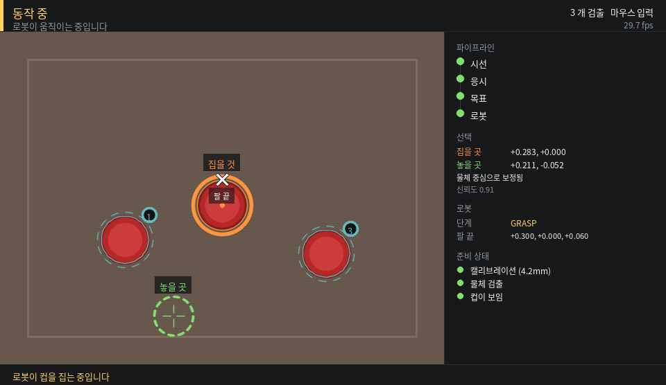

# 13. 시선 → 로봇팔 (`gaze_hri`) — 통합 가이드와 검증 결과

작성 2026-09-20. 대상 코드는 `ros2_ws/src/gaze_hri`, `ros2_ws/src/gaze_hri_msgs`.

---

## 0. 한 줄 요약

외부에서 받은 `gaze_hri_ws` ROS2 스택을 검증해서 **동작 불능 결함 3건과 설계 결함
2건을 고쳐** 이 저장소에 넣었다. 다만 **이 저장소에는 이미 다른 로봇팔 스택
(`arm/`)이 있고**, 둘은 태스크가 다르다. 어느 쪽을 시연에 쓸지는 아직 열려 있다.

---

## 1. 지금 로봇팔 스택이 둘이다

| | `arm/` (기존) | `gaze_hri` (이번) |
|---|---|---|
| 위치 | 브랜치 `fix/so101-runnable`, `origin/feat/so101-arm` | `ros2_ws/src/gaze_hri` |
| 태스크 | 컵을 집어 **입에 대고 기울여줌**(음용 보조) | 컵을 집어 **다른 자리에 놓음** |
| 팔 위치를 아는 법 | AprilTag 번들 PnP + SLAM latch | 그리퍼 끝을 응시해 Umeyama 정합 |
| 컵 위치 | YOLOv8-seg + 테이블 평면 교차 (씬카메라) | **탑다운 카메라** + 호모그래피 |
| 구조 | 단일 파이썬 프로세스 (+선택적 rclpy) | ROS2 노드 5개 |
| 통합 지점 | `GazeSource.frame()` 함수 하나 | UDP 55055 |
| 검증 | `arm/test_pipeline.py` (README 기준 13개) | `test/test_kinematics.py` 17개 |

`arm/`은 main에 없다. main만 보면 로봇팔 코드가 없는 것처럼 보이니 주의.

**중복이다.** 두 스택을 동시에 살려두면 통합 지점이 둘이 되고, 나중에 어느 쪽
좌표 규약이 맞는지 헷갈린다. 아래 7장에 정리한 결정이 필요하다.

### 머지 시 주의 — 캘리브 값이 어긋나 있다

`arm/` 브랜치는 merge-base가 2026-08-11이라 main의 캘리브 재작업을 못 받았다.
main의 현재 정본은 `ros2_ws/src/ocams_ros2/config/left_opencv.yaml`:

```
fx = fy = 461.23679   cx = 370.49543   cy = 242.77328
baseline = 79.151443 / 461.23679 = 0.17161 m
```

`arm/` 쪽 테스트는 `fx=484.711 / cx=326.836 / baseline 10.67cm`를 하드 기준으로
갖고 있다고 보고됐다. 그대로 머지하면 그 테스트부터 깨진다. `arm/`을 되살릴
경우 이 값부터 맞춰야 한다.

---

## 2. `gaze_hri`를 검증하면서 찾은 것

받은 코드를 돌려보고 수치로 재현한 결과다. 전부 수정했고, 수정 후 값도 같이 적었다.

### 2-1. dry-run 파지가 **항상 실패**했다 (동작 불능)

`DryRunBackend.read()`가 파지 성공 시 명령값을 그대로 돌려줘서 명령-실제 차이가
0이 됐다. 판정식은 "차이 > `grasp_margin`"이라 **성공이 구조적으로 불가능**했다.

| `fail_rate` | 수정 전 '물었음' | 수정 후 |
|---|---|---|
| 0.0 | 0 / 2000 | 2000 / 2000 |
| 0.5 | 0 / 2000 | 1001 / 2000 |
| 1.0 | 0 / 2000 | 0 / 2000 |

이 때문에 테스트 절차서의 4단계(좌표 검증)와 5단계(재시도 검증)가 통과 불가능한
상태였다. 모든 시도가 3회 재시도 후 abort로 끝난다.

### 2-2. 호모그래피 캘리브레이션이 **합격처럼 보이면서 틀렸다** (설계 결함)

캘리브 자세가 관절각으로 하드코딩돼 있었고, 그 자세들의 그리퍼 끝 높이가
**95.8mm 폭으로 흩어져** 있었다(3.6~13.1cm). 호모그래피는 평면↔평면 대응이라
캘리브 점이 전부 같은 높이여야 한다.

카메라 모델로 **같은 격자(테이블면 56점)·같은 렌즈**에서 수정 전후를 비교한 결과.
"수정 전"은 옛 자세 + 옛 RANSAC 임계값(5.0), "수정 후"는 새 자세 + 0.005다:

| 카메라 | 재투영(사용자가 보는 값) | 실제 테이블면 평균 | 최대 |
|---|---|---|---|
| 수직 — 수정 전 | 3.7mm ("좋음") | 17.91mm | 44.68mm |
| 수직 — 수정 후 | 0.0mm | **0.50mm** | 0.83mm |
| 15도 — 수정 전 | 4.2mm ("좋음") | 57.48mm | 149.47mm |
| 15도 — 수정 후 | 0.0mm | **1.86mm** | 2.66mm |
| 30도 — 수정 전 | 9.4mm ("사용 가능") | 372.46mm | 5499mm |
| 30도 — 수정 후 | 0.0mm | **3.54mm** | 4.43mm |

캘리브 점을 전부 같은 높이에 두면 오차가 사라지므로 원인이 높이 불일치임이
특정된다. 수정은 **캘리브 지점을 테이블면 위 (x, y)로 적어두고 관절각을 IK로
푸는 것**이다(`kinematics.TOPDOWN_CALIB_XY`). 높이 폭이 95.8mm → 0.00mm가 된다.
(수정 후 남는 0.5~3.5mm는 그리퍼를 테이블에서 5mm 띄운 값 자체 때문이다)

위험한 점은 **화면에 찍히는 숫자만 보고는 틀린 걸 알 수 없다**는 것이다.
그래서 캘리브 종료 시 "재투영 오차는 실사용 정확도를 보증하지 않는다"는 경고를
항상 출력하고, 절차서도 자 검증을 필수로 바꿨다.

### 2-3. `findHomography`의 RANSAC 임계값 단위가 틀렸다

목표값이 미터(0.28 같은 값)인데 임계값이 `5.0`이었다. 즉 **5미터**라 어떤
오클릭도 걸러내지 못했다(사실상 최소제곱). 14cm 잘못 클릭한 점을 넣어 보니
그대로 반영돼 평균 57.4mm 오차가 났고, `0.005`(5mm)로 바꾸니 정확히 제거됐다.

### 2-4. 통합하면 좌표계가 섞인다 (설계 결함 — 가장 큰 것)

4장에서 따로 설명한다.

### 2-5. 작동하지 않던 안전장치 3건

| 장치 | 문제 | 수정 |
|---|---|---|
| `dry_run` 목표 | 경고만 찍고 **서보를 그대로 구동** | 그 목표 동안 로그 백엔드로 교체, 끝나면 복원 |
| `/task/cancel` | `_cancel`을 True로 바꾸는 코드가 없어 **동작 중 취소 불가** | 취소 콜백 + 토픽 구독에서 플래그 설정, 각 단계에서 검사 |
| `min_confidence` | `GazeTarget`에 confidence 필드 자체가 없어 **검사 불가** | 필드 추가, `target_resolver`가 전달, `task_manager`가 검사 |

### 2-6. 그 밖의 수정

- `workspace_radius` 기본값 0.42가 실제 최대 도달거리 0.391보다 커서, 안전 검사를
  통과한 목표가 IK에서 실패했다 → 0.38로 낮추고 기동 시 자동 비교·경고
- 모호성 거부(1등-2등 간격 `ambiguity_margin`) 구현 — 문서에는 "대책"으로만 적혀
  있고 코드에 없었다
- 물체 목록이 비면 발행을 아예 안 해서, 컵을 치워도 옛 목록으로 스냅했다
  → 빈 목록도 발행 + 수신 측 `object_timeout`
- IK 실패 시 홈 복귀를 안 해 팔이 어정쩡한 자세로 멈췄다 → 복귀 추가
- `cartesian_step`이 선언만 되고 안 쓰였다(주석은 "직교 직선 보간"인데 실제로는
  관절 보간) → TCP 직선 보간 구현, 중간점이 안 풀리면 관절 보간으로 폴백
- 캘리브 중 전체 런치가 떠 있으면 팔이 제멋대로 집기 동작을 시작할 수 있었다
  → 전용 런치(`calibrate_world_to_base.launch.py`) 추가 + 위험 노드 감지 경고

### 2-7. 검증했고 **문제없었던** 것

고친 것만 나열하면 오해를 주므로 같이 적는다.

- **기구학**: IK로 푼 각을 FK에 다시 넣는 왕복 오차가 3000회 표본에서 1e-9 미만
- **Umeyama 정합**: 시선 잡음 20mm에서도 회전 복원 오차 1.84도
- **TF 방향**: `calib_tf_publisher`의 역변환과 `calibrate_world_to_base`가
  출력하는 `static_transform_publisher` 인자 순서 모두 정확
- **`grasp_margin` 실측 절차**: 절차서가 안내하는 값(컵 0.31 / 빈손 0.16 → 0.08)이
  코드 판정식과 일관. 수정된 dry-run이 내는 값과도 맞는다
- **"베이스 반경 15cm 이내 도달 불가"**: 사실 (0.15 불가 / 0.18 가능)

### 2-8. 초안 문서가 틀렸던 곳

- "접근각은 45도가 안 되면 60도" → 접근각마다 **닿는 거리 띠가 다르다**.
  75도는 0.20~0.29m, 45도는 0.26~0.35m, 20도는 0.30~0.38m. 가까우면 가파르게,
  멀면 얕게가 맞다(코드가 자동으로 여러 각을 시도한다)
- "세 변 길이를 알면 각도는 하나로 정해진다" → 팔꿈치 위/아래 **두 해**가 있고,
  5자유도라 접근 피치각을 추가로 고정해야 풀린다
- "통합해도 노드 4개는 한 줄도 안 바뀐다" → `target_resolver`는 바뀌어야 했다(4장)
- 통합 스니펫이 부르는 `rotation_matrix_to_quat`가 **이 저장소에 없었다**
  (그대로 붙이면 `NameError`) → `src/fusion.py`에 추가

---

## 3. 눈 카메라를 바꿔도 영향이 없다

눈 카메라는 GC0308에서 교체 예정이다. `gaze_hri`는 이 교체에 **영향받지 않는다.**
입력 경계가 "3D 점 하나 + valid 플래그"이기 때문이다(`gaze_bridge`).

```
[눈 카메라 무엇이든] → 동공 → 시선벡터 ┐
                                      ├→ 융합 → p_W ──UDP──> gaze_bridge → 로봇
[oCamS 스테레오 + IMU] → 깊이 + pose ┘
```

바뀌는 것은 융합 앞단이고, 로봇 쪽은 `p_W`의 **정확도**만 신경 쓰면 된다.
씬 카메라(oCamS-1MGN-U 스테레오+IMU)는 확정이므로 위 캘리브 정본이 계속 유효하다.

---

## 4. 좌표계 — 통합에서 가장 조심할 곳

### 문제

통합하면 두 입력이 **다른 좌표계**로 들어온다.

```
/gaze/fixation   ← 안경.   SLAM world(map) 기준
/objects/poses   ← 탑다운. 로봇 base_link 기준 (호모그래피 결과)
```

받은 코드의 `target_resolver`에는 TF 변환이 없었고(tf2 import조차 없음), 두 점을
**그대로 거리 비교**했다. 게다가 탑다운이 `frame_id="map"`을 달고 있어서 겉보기에
같은 프레임처럼 보였다.

안경을 로봇 왼쪽 뒤 50cm에서 켜고 30도 틀어진 상황을 계산하면:

```
같은 컵:  로봇기준 (0.300, -0.090, 0.050)
          SLAM기준 (0.473, -0.781,  0.250)
두 점 사이 거리 = 74.0 cm   →  snap_radius 8cm 밖 → 스냅 실패
억지로 스냅되면 arm_server가 변환을 한 번 더 걸어 74cm 어긋난 곳으로 이동
```

**로봇 단독 모드는 `map = base_link` 항등이라 이 결함이 전혀 드러나지 않는다.**
통합하는 날 처음 나타난다.

### 수정한 규약

> **모든 판정과 목표는 `base_link`에서 한다.**

| 노드 | 내보내는 프레임 |
|---|---|
| `gaze_bridge` | `map` (SLAM world) — 그대로 |
| `topdown_click` | **`base_link`** (호모그래피 결과의 실제 정체) |
| `target_resolver` | 입력을 전부 `base_link`로 변환해 비교, 목표도 `base_link` |
| `task_manager` | `GazeTarget.header.frame_id`를 액션 목표에 전달 |
| `arm_server` | `goal.frame_id`를 보고 필요할 때만 변환 |

`GazeTarget`과 `PickPlace.action`에 프레임 정보를 명시적으로 실었다.
TF를 못 찾으면 **"그대로 쓰지 않고" 목표를 거부한다.** 좌표계가 다른 값을 그대로
쓰면 팔이 엉뚱한 곳으로 가는데, 그게 조용히 일어나면 안 되기 때문이다.

---

## 5. 하드웨어 요구 — 아직 없는 것

| 항목 | 상태 |
|---|---|
| SO-ARM101 | 필요 |
| **탑다운 카메라** | **레포 하드웨어 목록에 없다.** 새로 필요 |
| oCamS-1MGN-U | 있음 (씬 카메라, 확정) |
| 눈 카메라 | 교체 예정 (로봇 쪽에 영향 없음) |
| 링크 길이 실측 | **안 됐다.** config 기본값은 추정치다 |

링크 길이가 틀리면 호모그래피 캘리브레이션(로봇 자신을 자로 쓴다)부터 전부
틀어진다. 실기 작업의 첫 단추다.

`arm/` 쪽은 별도로 **받침대 12~14cm가 필수**라고 기구학으로 결론내고 있다
("컵을 세운 채 들 수 있는 최대 높이가 팔 베이스 기준 12cm"). 그건 입 높이까지
들어올려야 하는 음용 보조 태스크의 제약이다. 컵을 테이블 위에서 옮기기만 하는
`gaze_hri` 태스크에는 그대로 적용되지 않지만, **두 태스크를 다 하려면 받침대
높이를 정할 때 같이 봐야 한다.**

---

## 6. 통합 GUI

한 창에서 전체 파이프라인을 보고 조작한다. `control_panel` 노드다.



보이는 것:

- 탑다운 영상 위에 **검출된 컵**(번호 배지)과 **선택 결과** — 집을 것(주황 링),
  놓을 곳(초록 점선)
- **시선/커서 위치와 응시 진행률** — 원호가 다 차면 선택된다
- **팔 끝(TCP)** — 관절각을 순기구학으로 풀어 화면 위에 표시. 로봇이 목표로
  제대로 가고 있는지 눈으로 바로 확인된다
- 사이드바: 파이프라인 어디까지 왔는지, 선택된 좌표와 신뢰도, 물체 중심으로
  보정됐는지, 로봇 동작 단계, 준비 상태(캘리브·검출·컵 보임)

조작:

| 키 | 하는 일 |
|---|---|
| 좌클릭 | 지금 보는 곳을 선택 (마우스 모드) |
| **우클릭** | **그 자리 색으로 컵 검출 범위를 잡는다** |
| **`k`** | **호모그래피 캘리브레이션 시작 / 중단** |
| `u` | 캘리브 중 직전 클릭 취소 |
| `c` | 선택 취소 / 동작 중단 |
| `space` | 비상 정지 |
| `d` | 물체 검출 켜기·끄기 |
| `q`, ESC | 종료 |

캘리브레이션이 안 돼 있으면 화면 가운데에 크게 알려준다(좌표가 아예 안 나오는
상태이므로). `k` 한 번이면 그 자리에서 할 수 있다.

한글 폰트(Noto CJK, 나눔)가 있으면 한글로, 없으면 영문으로 자동 전환된다.

화면 구성은 `panel_render.py` 에 ROS와 분리해 두었다. 하드웨어 없이 미리 볼 수 있다:

```bash
python -m gaze_hri.panel_render preview.png executing   # idle | pick | executing
```

> `control_panel` 은 카메라를 직접 열고 물체 검출까지 담당한다. 그래서
> `topdown_click` 과 **동시에 띄우면 안 된다**(카메라를 두 번 열게 된다).
> 호모그래피 캘리브레이션만 `topdown_click` 이 맡는다.

---

## 7. 실행

```bash
cd ros2_ws && colcon build --symlink-install && source install/setup.bash
```

통합 GUI:

```bash
ros2 launch gaze_hri gui.launch.py                                  # 마우스 입력, dry-run
ros2 launch gaze_hri gui.launch.py backend:=feetech                 # 실제 구동
ros2 launch gaze_hri gui.launch.py input:=gaze source:=udp backend:=feetech
```

ROS 없이 도는 검증(기구학·좌표계·파지 판정·화면 구성 26개):

```bash
python -m unittest discover ros2_ws/src/gaze_hri/test -v
```

로봇 단독 — GUI 없이 옛 방식으로 돌릴 때(캘리브레이션은 이쪽을 쓴다):

```bash
ros2 launch gaze_hri robot_only.launch.py mode:=calib backend:=feetech   # 캘리브
ros2 launch gaze_hri robot_only.launch.py                                # dry-run
ros2 launch gaze_hri robot_only.launch.py backend:=feetech               # 실제 구동
ros2 launch gaze_hri robot_only.launch.py detect_objects:=true           # 컵 여러 개
```

통합:

```bash
python src/gaze_udp_sender.py                                            # 배선 확인용
ros2 launch gaze_hri calibrate_world_to_base.launch.py source:=udp backend:=feetech
ros2 run gaze_hri calibrate_world_to_base                                # T_BW
ros2 launch gaze_hri gaze_hri.launch.py source:=udp backend:=feetech
```

단계별 절차와 통과 기준은 `ros2_ws/src/gaze_hri/ROBOT_ONLY_TEST.md`,
개념 설명은 `팀원_설명서.md`.

---

## 8. 실기에서 무엇부터 해야 하나

**"빌드하고 클릭하면 컵을 옮긴다"가 아직 아니다.** 순서대로 해야 하고,
각 단계는 앞 단계가 맞아야 의미가 있다. 상세 절차와 통과 기준은
`ros2_ws/src/gaze_hri/ROBOT_ONLY_TEST.md`.

### 0. 빌드 — 이걸 아직 아무도 안 해봤다

```bash
cd ~/창종설/ros2_ws
colcon build --symlink-install && source install/setup.bash
ros2 pkg list | grep gaze                       # 두 패키지가 보여야 한다
ros2 interface show gaze_hri_msgs/msg/GazeTarget   # confidence 필드가 있어야 한다
```

작성 환경에 `rclpy` C 확장이 없어 **노드를 한 번도 띄워보지 못했다.** 메시지
정의는 실제 rosidl 파서로, 파라미터·토픽·entry point 정합성은 전수 검사로
확인했지만, 기동은 여기서 처음 해보는 것이다.

### 1. 하드웨어 — 지금 없는 것

| 필요한 것 | 상태 |
|---|---|
| SO-ARM101 + 책상 고정 | 확인 필요 |
| **탑다운 카메라 + 마운트** | **레포 하드웨어 목록에 없다. 새로 필요** |
| 시연용 컵 (원통형, 지름 7~8cm, 같은 색) | 필요 |
| 조명 고정 (색 검출이 조명에 민감) | 필요 |

### 2. 숫자 채우기 — 이게 틀리면 전부 틀린다

1. **링크 길이 실측** → `config/gaze_hri.yaml` 의 `base_height / shoulder_offset
   / l1 / l2 / l3`. 지금 값은 **추정치다.** URDF 의 joint origin 을 읽거나 자로 잰다.
   이 값이 틀리면 호모그래피 캘리브레이션(로봇 자신을 자로 쓴다)부터 틀어진다.
2. **서보 부호·중립** (`servo_signs`, `servo_offsets`) — 반대로 돌면 위험하니
   속도를 낮추고 손으로 잡을 수 있는 자세에서.
3. **순기구학 검증** — 계산값과 자로 잰 값이 10mm 이내. 여기를 못 넘기면
   뒤에서 절대 못 맞춘다.

### 3. 카메라 ↔ 로봇 연결 — GUI 안에서 다 된다

GUI 를 띄우면 캘리브레이션과 컵 색 지정을 **창 하나에서** 할 수 있다.
(별도 프로그램을 띄우면 카메라를 두 프로세스가 다투게 된다)

```bash
ros2 launch gaze_hri gui.launch.py backend:=feetech
```

4. **`k` 를 누른다** → 팔이 테이블면 위 8개 지점을 차례로 잡는다.
   팔이 멈춘 뒤 화면에서 **그리퍼 끝을 클릭**한다. 잘못 눌렀으면 `u` 로 되돌린다.
   8개를 다 찍으면 자동으로 계산·저장되고 바로 적용된다.
   - 손이 미끄러져 크게 빗나간 클릭은 RANSAC 이 알아서 제외한다.
   - 캘리브 점은 전부 같은 높이(테이블면 위 5mm)라 평면 가정이 성립한다.
5. **`우클릭`으로 컵 색 지정** — 컵을 한 번 우클릭하면 그 자리 색으로 검출
   범위를 잡고 바로 켠다. 터미널에 `hsv_lower/upper` 가 찍히니 config 에 남긴다.
6. **좌표 검증** — 화면 여러 곳에 커서를 두고 표시되는 좌표를 자로 잰 값과 비교.
   **재투영 오차가 작다고 넘어가지 말 것**(2-2 참고). 이게 마지막 관문이다.

### 4. 모터 없이 흐름 확인

7. `ros2 launch gaze_hri gui.launch.py` (기본 dry_run) — 컵 클릭 → 놓을 자리 클릭 →
   `EXECUTING` 까지 흐르고 관절각이 상식적인지. 팔 끝 표시가 목표로 가는지.
8. `fail_rate:=0.5` 로 재시도·복구 경로 확인.

### 5. 실제 파지

9. `backend:=feetech` 로 첫 동작. 전원 스위치를 손 닿는 곳에, 첫 시도는 컵 없이.
   문제가 보이면 **`space` 가 비상정지**다.
10. **`grasp_margin` 실측** — 컵 물었을 때와 빈손일 때 `gripper` 값 차이의 절반.
11. 컵 위치를 바꿔가며 30회, 성공률 기록.

### 6. 안경 연동

12. 융합 루프에 세 줄 추가 (`GazeUdpSender`) → `python src/gaze_udp_sender.py` 로
    배선만 먼저 확인.
13. **`T_BW` 캘리브레이션** — `calibrate_world_to_base.launch.py` (전용 런치를
    쓸 것. 전체 런치로 하면 팔이 캘리브 도중 제멋대로 움직일 수 있다).
14. `gui.launch.py input:=gaze source:=udp backend:=feetech`.

---

## 9. 남은 결정과 리스크

### 결정이 필요한 것

1. **`arm/`과 `gaze_hri` 중 무엇을 시연 스택으로 삼을 것인가.**
   지금은 `gaze_hri`(컵 옮기기) 방향으로 정리했지만 `arm/`은 그대로 살아 있다.
   `arm/`을 접는다면 그 브랜치의 자산(AprilTag latch, YOLO 컵 검출, anchor drift
   지표)을 `gaze_hri`로 옮길지 결정해야 한다. 특히 **anchor drift는 보고서에
   쓸 정량 지표**라 버리기 아깝다.
2. **컵 위치를 탑다운으로 잡을 것인가, 씬카메라 YOLO로 잡을 것인가.**
   받은 README는 씬카메라+YOLO를, 팀원 설명서는 탑다운+호모그래피를 전제한다.
   둘은 좌표계도 정확도도 다르다. 탑다운이면 카메라를 새로 사야 하고,
   씬카메라면 "시선 오차가 파지 정확도에 영향을 주지 않는다"는 설명이 성립하지
   않는다(둘 다 같은 오차 경로를 탄다).
3. **UDP를 쓸 것인가.** `arm/`은 `GazeSource.frame()` 함수 하나로 통합 지점을
   좁혀놨다. UDP는 이 저장소에 전례가 없고 `docs/04_sync.md`의 타임스탬프 동기화
   설계와도 따로 논다. 다만 의존성 분리 이점은 실재한다.

### 검증하지 못한 것

- **실기 테스트 전무.** 위 수정은 전부 코드·수치 검증이다. 서보 부호, 중립
  오프셋, `grasp_margin` 실측값은 하드웨어에서만 확인된다.
- **ROS2 노드 실행 검증 안 됨.** 이 작업 환경에 `rclpy` C 확장이 없어
  (`/opt/ros/jazzy`가 python3.12인데 확장은 3.13용) 노드를 띄워보지 못했다.
  순수 파이썬 문법·기구학·좌표 변환 로직만 검증했다. **빌드 후 노드 기동은
  실기에서 처음 해보는 것이다.**
- 스테레오 깊이는 `docs/12`가 "로봇팔 제어에 사용 금지"로 두고 있다
  (2026-08-29에 1m 근처는 개선됐으나 1.5m는 ~12% 오차 잔존). `gaze_hri`의
  `p_W`도 이 깊이를 쓰므로, **컵 위치를 탑다운이 담당하는 구조가 이 제약을
  우회하는 방법**이기도 하다. 시선은 "어느 컵인지"만 고르면 되기 때문이다.
