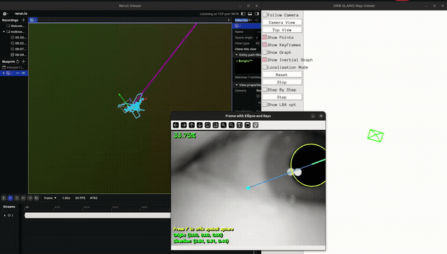

# 2026-07-30 — docs/03_fusion.md 착수 + docs/09 A-1/A-2 + ORB-SLAM3/Rerun 연결



## 한 일

1. `src/fusion.py` 신규 — `gaze_point_world(u, v, D, K, T_WS)` 구현
   (docs/03_fusion.md 그대로). 항등/평행이동/회전+평행이동 3가지 pose로
   "3D점 → (u,v,D) 순방향 → world 3D점 역복원" 왕복 검증, 오차 1e-15 수준으로 통과
   (`python src/fusion.py`). docs/03 체크리스트 1번 완료 처리.

2. `src/ocams_calib.py` 신규 — `ocams_ros2/config/{left,right}_opencv.yaml`의
   기존 stereo rectification 결과(camera_matrix/distortion/rectification_matrix/
   projection_matrix)로 `cv2.initUndistortRectifyMap` 맵 생성. `RECTIFIED_K`
   (fx=fy=433.553025, cx=470.352457, cy=236.488789), `BASELINE_M`(~12.48cm)도
   여기서 계산해서 단일 출처로 노출.

3. **좌표계 버그 발견 및 수정**: `gaze_on_scene.py`는 지금까지 oCamS **raw**(왜곡보정 전)
   좌영상 위에서 다점 캘리브레이션(R, fx)을 하고 있었다. `docs/03_fusion.md`의 스테레오
   깊이 공식은 **rectified** 좌표계의 K를 전제로 하기 때문에, 이 상태로 스테레오 깊이를
   연결하면 시선 픽셀과 깊이가 서로 다른 좌표계라 어긋난 3D점이 나올 뻔했다.
   → `scene_left()`에 rectify 맵 적용 옵션 추가, 기본 해상도를 640x480(캘리브레이션
   해상도)으로 변경, 기본 fx/cx/cy를 `SW*0.94` 근사 대신 `ocams_calib.RECTIFIED_K`의
   정확한 값으로 교체. `--scene-width/height`를 캘리브레이션 해상도와 다르게 주면
   rectify를 건너뛰고 경고 출력(안전장치).

4. **docs/09_visualization.md A-1 완료 (파일 IPC 제거)**: `Orlosky3DEyeTracker.py`의
   `compute_gaze_vector()`가 매 프레임 `gaze_vector.txt`에 쓰던 코드 삭제,
   `process_frames()`가 `last_tracking_result`에 `gaze_origin`/`gaze_direction`을 담도록
   수정, `process_frame()`이 `(final_rotated_rect, gaze_direction)` 튜플을 바로 반환하도록
   변경. `gaze_on_scene.py`의 `read_last_gaze()`(파일 읽기)와 `GAZE_TXT` 관련 코드 삭제,
   `tracker.process_frame(eye)` 호출부를 `_ellipse, d = tracker.process_frame(eye)`로 교체.
   패치 내용은 `patches/PATCH_NOTES.md`(패치 2)에 기록 — `external/`은 gitignore라 재클론 시
   이 문서 보고 다시 적용해야 함.

5. **docs/09_visualization.md A-2 일부 완료 (Rerun 배선)**: `rerun-sdk` 설치(0.35.0),
   `gaze_on_scene.py`에 `rr.init(...)` + 매 프레임 `rr.log()` 추가 — `eye/ir`(눈 IR 영상),
   `scene/image`(rectified 씬 영상), `scene/gaze_cursor`(계산된 시선점), `scene/calib_points`
   (다점 캘리브 클릭 지점들). `--no-rerun`으로 끌 수 있음.
   **주의**: 문서 원안은 "cv2 창 → Rerun으로 교체"였지만, 다점 캘리브가 `cv2.setMouseCallback`
   마우스 클릭에 의존하고 있어서 **cv2 창은 그대로 두고 Rerun 로깅만 병행 추가**하는 걸로
   범위를 좁힘. cv2 창을 완전히 없애려면 Rerun 쪽에서 클릭 좌표를 받는 방법을 따로 찾아야 함
   (이번엔 안 함).

## 확인 못 한 것 / 확인 방법

카메라가 연결 안 된 상태라(오늘 세션 중 `/dev/v4l/by-id` 없음) **실캡처로는 검증 못 함.**
대신 할 수 있는 만큼 확인함:
- `ocams_calib.py`, `fusion.py` 단독 실행 — 맵 생성/기하 계산 통과 (`python src/ocams_calib.py`,
  `python src/fusion.py`)
- `import gaze_on_scene` — 외부 트래커/ocams_calib/rerun 전부 정상 import 확인
- `tracker.process_frame(합성 랜덤 이미지)` — 새 반환값 형태(튜플)로 정상 동작, 크래시 없음
- `gaze_vector.txt`가 더 이상 생성 안 되는 것 확인 (파일 IPC 제거 검증)
- Rerun 자체 API(`rr.Image`, `rr.Points2D`, `rr.set_time`)는 독립 스모크 테스트로 확인 —
  단 `gaze_on_scene.py`의 실제 루프 안에서 rerun 뷰어에 정상 렌더링되는지는 실카메라 필요

## 다음

- [x] ~~실카메라로 오늘 변경사항 전부 실제 확인~~ — 카메라 연결해서 실제로 돌림 (아래 계속)
- [ ] StereoSGBM으로 실제 D 얻기 (좌/우 rectified 영상 둘 다 필요 — 지금 `ocams_calib`가
      right map도 만들어주지만 `gaze_on_scene.py`는 아직 왼쪽만 씀)
- [x] ~~`/orbslam3/pose` 구독 노드 작성~~ — `src/orbslam3_rerun.py`
- [x] ~~융합 결과(gaze ray)를 Rerun 3D 뷰에 추가~~ — 깊이(D) 없이 고정 길이 근사로 우선 구현
- [ ] docs/03 체크리스트 2, 3번 (실물 정확도, pose 이동 시 월드 고정성) — 아직 실하드웨어로 못 함
      (SLAM 자체가 불안정해서 우선순위 아래 항목이 먼저)

---

## 이어서 (같은 날, 실카메라 연결 후)

### 실캡처로 오늘 변경사항 확인
카메라 연결해서 `gaze_on_scene.py --scene-flip` 실행 — rectify된 씬 영상 정상, 다점 캘리브도
정상 동작 확인. 씬 카메라가 물리적으로 거꾸로 마운트되어 있어서 `--scene-flip` 필요
(안경 하우징 재설계 전까지 계속 필요 — 메모리에 기록해둠).

**Rerun 크래시 발견/수정**: 매 프레임 원본 해상도 이미지를 스로틀링 없이 로깅했더니 몇 분 만에
gRPC 서버 메모리 한도(1GiB) 초과 → transport error로 스크립트 전체가 죽는 문제 발견.
`--rerun-every`(기본 3프레임에 1번만 이미지 로깅) 추가 + `rr_log_safe()` 래퍼로 로깅 실패해도
스크립트는 안 죽게 수정.

### ORB-SLAM3 stereo-inertial 파이프라인 — 이미 다 빌드되어 있었음
`~/ORB_SLAM3`, `~/ros2_ws`(별도 워크스페이스, `MoLBWA/ros2_ws`와 다름)에 7/14 세션에서 이미
클론+패치+빌드 완료된 상태로 남아있었음. 새로 할 일 없이 바로 실행:
```bash
ros2 run ocams_ros2 ocams_stereo_imu_node   # 카메라+IMU
ros2 run orbslam3 stereo-inertial ~/ORB_SLAM3/Vocabulary/ORBvoc.txt \
    ~/ros2_ws/src/orbslam3_ros2/config/stereo-inertial/oCamS.yaml false
```
(`LD_LIBRARY_PATH`에 `~/ORB_SLAM3/lib` 등 안 잡혀있으면 `libORB_SLAM3.so` 못 찾음 — 직접 export 필요)

`/orbslam3/pose` 정상 발행 확인.

### `src/orbslam3_rerun.py` 신규 — SLAM pose + 시선 광선을 Rerun 3D에
`/orbslam3/pose` 구독 + 눈 카메라(Sonix) 직접 열어서 `gaze_on_scene.tracker.process_frame()`
재사용 → `world/cam`(Transform3D), `world/trajectory`(LineStrips3D), `world/gaze/ray`
(Arrows3D, 깊이 없어서 고정 2m 길이 근사)를 Rerun에 로깅. rclpy 때문에 python3.12로 실행.

**rerun-sdk 버전 충돌 삽질**: python3.12용으로 최신 rerun-sdk(0.35.0) 설치했더니 numpy>=2를
요구해서 깔았는데, 그 바람에 같은 환경의 scipy(KDTree 바이너리 깨짐)/mediapipe(matplotlib
경유 바이너리 깨짐)가 연쇄로 망가짐 — VPT 프로젝트의 `gaze_bridge_node.py`/`raycasting_node.py`
가 쓰는 것들이라 방치하면 그쪽도 깨짐. **rerun-sdk를 numpy<2를 요구하는 0.20.0으로 맞추는 걸로
해결** (scipy도 그에 맞는 버전으로 재설치). anaconda python3.13 쪽(`gaze_on_scene.py`용)은
별개 환경이라 0.35.0 그대로 둠 — 두 파이썬 환경의 rerun 버전이 다르니 나중에 헷갈리지 말 것.
뷰어 바이너리도 PATH에 anaconda 것(0.35.0)이 먼저 잡혀서 버전 불일치 경고 났었음 →
`PATH=~/.local/lib/python3.12/site-packages/rerun_sdk/rerun_cli:$PATH`로 python3.12용 뷰어
우선하도록 실행.

**핵심 발견 — SLAM 자체가 불안정함, 캘리브레이션 문제**: `/orbslam3/pose`가 심하게 튐. 로그에
"New Map created" → "Fail to track local map!" → "IMU is not or recently initialized.
Reseting active map..." 패턴이 698번 반복되는 걸 확인. 원인은 이미 `oCamS.yaml`/
`patches/orbslam3_patches.md`에 문서화되어 있던 문제: **`IMU.T_b_c1`(카메라-IMU 외부
파라미터)이 identity placeholder라 실제 카메라-IMU 상대 위치/각도를 전혀 반영 안 하고 있음.**
→ 다음 우선순위: **Kalibr로 camera-IMU extrinsic 실측 캘리브레이션.** 필요한 것: AprilGrid
타겟(딱딱한 판에 정확한 크기로 인쇄), Kalibr Docker(ROS1 기반이라 host에 안 깔고 도커로),
카메라+IMU 동시 녹화한 rosbag(6방향 다 흔들면서, 여러 각도로 타겟 비춤 — ROS2 bag이라
`rosbags` 라이브러리로 ROS1 bag 포맷 변환 필요).

시선 광선(`world/gaze/ray`)도 이 불안정한 pose 위에서 그려지는 거라 같이 흔들림 — 캘리브레이션
전까지는 광선 자체의 "방향"이 의미 있어도 위치가 계속 리셋되는 건 감안하고 봐야 함.

데모 캡처: `assets/orbslam3_gaze_ray_rerun.gif`

## 전체적으로 다음에 할 일 (우선순위순)
1. **Kalibr camera-IMU extrinsic 캘리브레이션** — SLAM 안정성의 근본 원인, 이게 없으면 나머지 다 흔들림
2. StereoSGBM 깊이 → `world/gaze/ray`를 근사(고정 길이) 대신 진짜 `p_W`로 교체
3. 눈-oCamS 상대 회전(현재 "광학축 동일" 가정) 실측 — 시선 방향의 world 변환 정확도에 영향
4. docs/03 체크리스트 2, 3번 실물 검증
